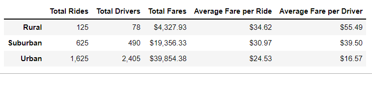
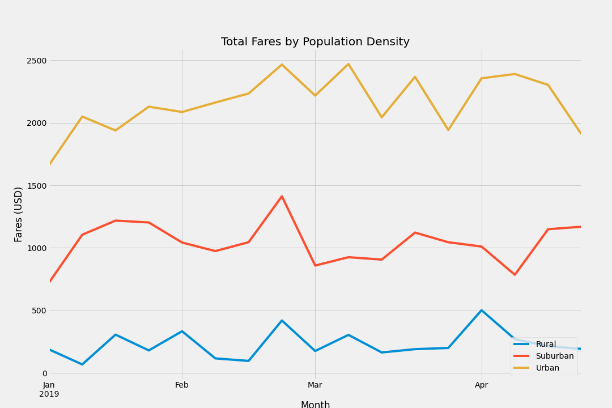

# PyBer_Analysis
## Overview
This project is an analysis of Pyber ride data. Pyber, a personal transportation company similar to Uber, is interested in a breakdown and visualization of their ride data. Pyber is interested in seeing their fares and driver data broken down by city population types rural, suburban and urban. The purpose of this project is to generate such analysis and data visualization with matplotlib's pyplot in a jupyter notebook.  
## Results

* In the figure above we find that total the most total rides in urban areas and the least in rural areas
* We find the most drivers in urban areas and the least drivers in rural areas
* We find the greatest total fares in urban areas and the least in rural areas
* Conversely, we find the greatest average fare per ride in rural areas and the least in urban areas
* We find the greatest average fare per driver in rural areas and the least in urban areas

* In the figure above, we take note of similar trends in fares by living areas from 01-01-2019 through 04-28-2019.
  * More notably, we find similar trends between suburban and rural living areas
* The vertical displacement of each line depicts the greater total fares in urban than suburban than rural living areas noted above
## Summary
