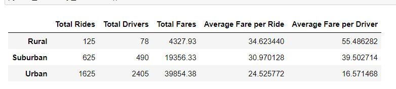

# PyBer_Analysis
## Overview
This project is an analysis of Pyber ride data. Pyber, a personal transportation company similar to Uber, is interested in a breakdown and visualization of their ride data. Pyber is interested in seeing their fares and driver data broken down by city population types rural, suburban and urban. The purpose of this project is to generate such analysis and data visualization with matplotlib's pyplot in a jupyter notebook.  
## Results

## Summary
